# price_and_vol

在参数化策略的实现中，控制思想应用在策略中并不是一个新鲜的话题。有学者和卖方研究人员将量化交易比作核工程，以模型和系统支持数据等为核工程系统，以策略信号到交易逻辑执行部分为核武器。虽然这两者在很多方面都大相径庭，但是从系统的非稳定性和对实际工程经验的依赖来说，依然存在许多思想上可迁移的相似性。在核工程系统中有效的局部以及整体到局部的控制方法论是关键，因此在工程控制上颇有造诣的钱学森在理论和实践基础都不完备的早期贡献了诸多核工程和火箭工程应用，在其著作《工程控制论》中**论证了如何用可靠度低的零件组成可靠度高的系统**。

Qian Xuesen contributed many nuclear engineering and rocket engineering applications in the early stage when the theoretical and practical foundation was not complete. 

In his work Cybernetics of Engineering, he demonstrated how to use components with low reliability to form a system with high reliability.

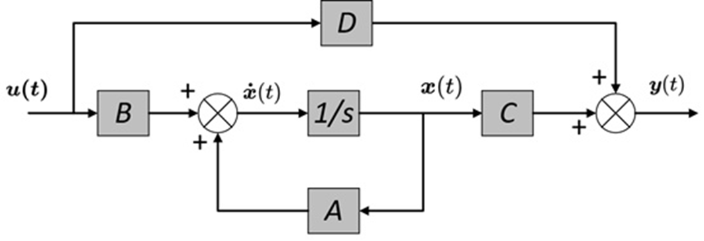

上图是经典的通用有前馈的PID模型，我们策略的框架本质上也可以抽象为如此的控制系统。D部分相当于前馈系统，如策略在市场中根据传入信号$u(t)$对盘口进行实时的成本计算和下单就是一个典型的前馈系统。A部分就是反馈系统，类似BP网络，在很多参数化策略中，比如根据因子暴露度调节因子在策略中的可投资价值都可以看做一个反馈系统。

So we could make a Parameterization trading strategy like that PID system.

将市场进行微分，并确保策略在每一段区间上盈利。

Differentiate the market and make sure the strategy is profitable on each segment.

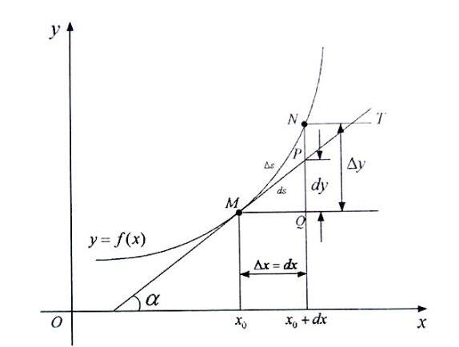

对于每一段区间的aum和hit，账户净买入卖出均价，和内盘当前余额作为输入信号加入下一段区间的$u(t)$

for aum and hit in every seg, use the net buying/selling average price of the account, and the current balance of the internal plate as input signal to add $U (t) to the next range.

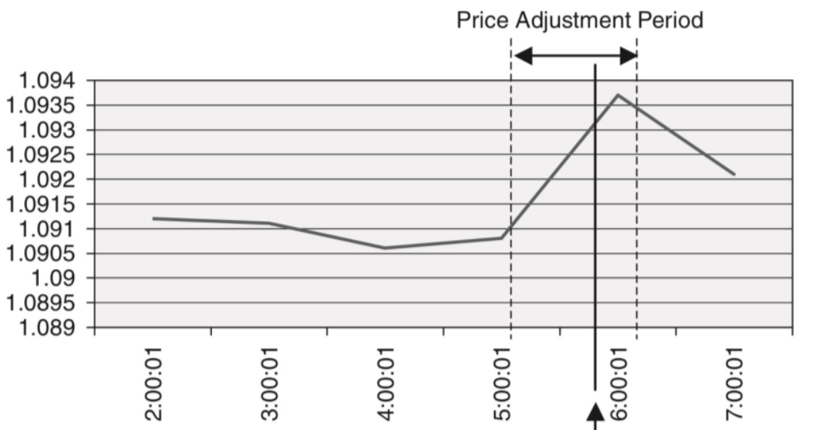

对于做市中必然盈利的部分（这里的盈利标准是实现低买高卖，例如在current_price之上高于卖出均价的ask单，就可以认为都是盈利的部分。利用当前余额沿着指数函数摆盘。对于做市中可能亏损的部分，如上一段净买入均价到当前价的bid单，上一段净卖出均价到当前价的ask单，我们根据上一段区间的盈利计算摆盘后亏损的最大上限，设计算法以第三档为上一段均价，确定前三档的价格，再利用分配机制进行下单数量的分配，确保该段亏损不会超过上一段盈利，这里的形式化表达以买入亏损的状态为例。

Follow the buy low, sell high rule, we cal the the price range in which losses are likely to occur

$$\min(\delta amount_t) = (\delta amount_{t-1} - bid_{nega} ) + aum_{posi} $$

$$st. \delta amount_{t-1} - bid_{nega} > 0   $$

虽然成交数量取决于市场行为，是不可控的，我们的亏损可能来自于不活跃的交易等等因素。但我们可以通过一些基本的统计方法和工程控制思想得到一个最优的亏损区间段上的下单数量分配方案。我们引入反馈调节部分，传入一个松弛变量$alpha$用来约束$bid_{nega}$，因为该部分下单所用的资金总量和数额都可以确定下来，策略根据$alpha$的值确定预留一定比例的资金和币(需要同时控制币数的定量，因为如果只是减少资金投入是买不回同样数量的币数的)

Although the volume of transactions depends on market behavior and is not controllable, however, we can obtain an optimal order quantity allocation scheme on the loss interval by using some basic statistical methods and engineering control ideas like this.

$$ bid_{nega} = \sum_{i=1}^3(qty_i * price_i) $$

$$\delta amount_{t-1} = bidqty_{t-1} * meanprice_{t-1}$$

$$ ·bid_{nega} = \delta amount_{t-1} * alpha $$

$$ ·bidqty_{t} =  bidqty_{t-1} * (alpha - 0.05) $$

$$st. meanprice_{t-1} < meanprice_{t} $$

$$and\  \delta amount_{t-1} - bid_{nega} > 0$$

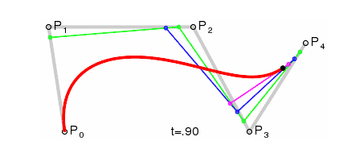

为解决交易不活跃的问题，构建几何布朗运动（GBM）模型，将中心价进行无规律的随机游走，同时改进模型，让其价格的随机变动的上下边界在我们可接受的范围内。在进入交易逻辑之前，将当前价的千分之一作为阈值，并计算两次摆盘之间的delta_price。如果delta_price大于该阈值我们认为交易活跃，小于该阈值或者摆盘账户币数净出入为0则认为交易不活跃。

for the problem of inactivity, we build the GBM model for fake trade channels

$$\delta price = price_t - price_{t-1}$$

$$threshold =  price_t * 0.001 $$

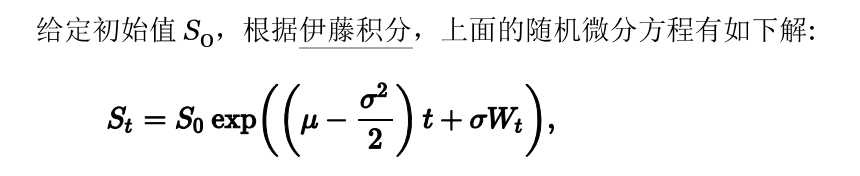

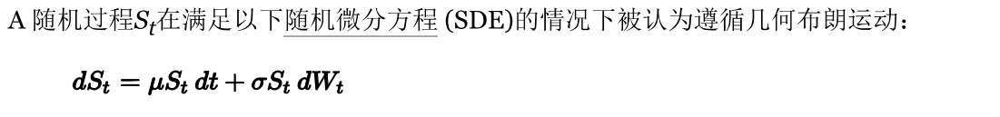

构建 GBM baseline model 并进行本地参数测试

test the local baseline

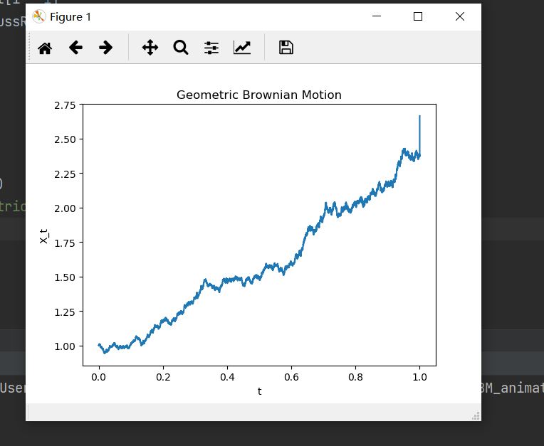

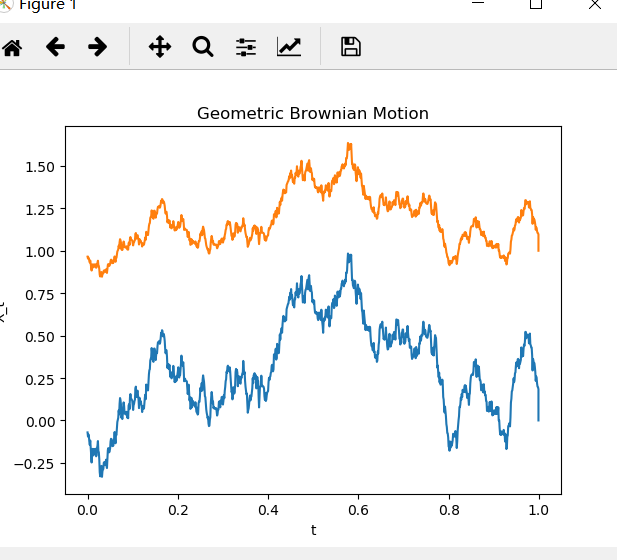

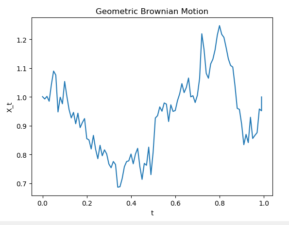

根据markov基本原理，我们使每一次传入的价格会迭代生成下一个。考虑到市场价格会因为交易不断改变，每一次调用刷量计算一次买一卖一的均值（mean），并以两次刷量的这段时间间隔上的均值之差作为偏移量（beta）的根据正态分布函数的数学原理让模型返回值位于（-1,1）的区间，让模型回传一个比率，该比率和当前价格共同确定一个新的波动后的值。

follow the markov principle, every price will define the next price. The return value of GBM will control in (-1,1)

$$shiftPrice = lastPrice + \beta ,\  \beta =  \Delta mean = mean_{t} - mean_{t-1}$$

$$ f(shiftPrice, model) = vi\ \epsilon (-1,1)$$

$$ returnPrice = vi * k , \ k = currentPrice * 0.001$$

投入实际使用的结果。可见量的一致性以及打针问题。

the effect of the model will look like this. you will see the vol is almostly the same. And the price always get a shot in the market.

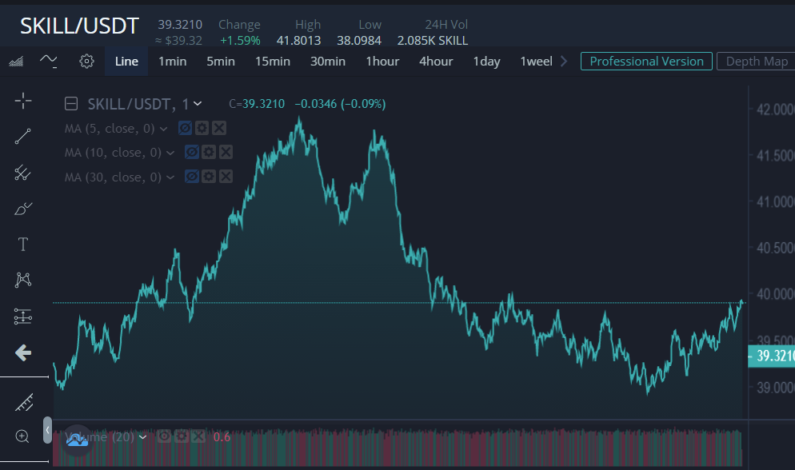

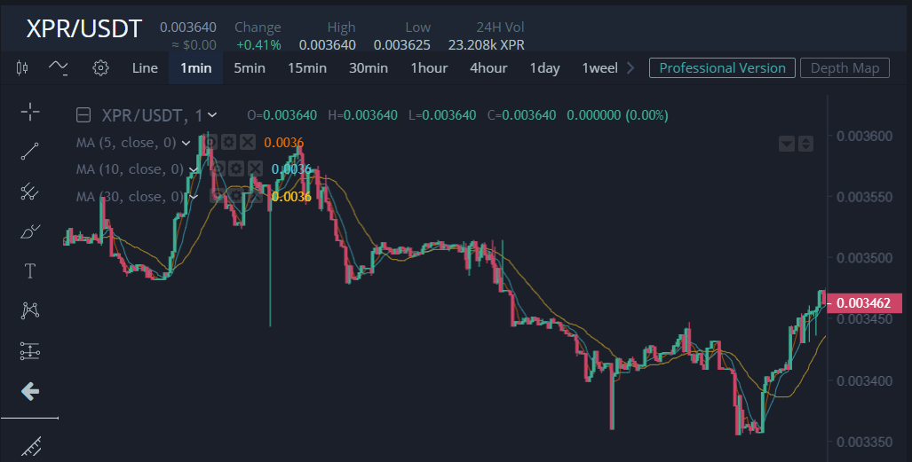

we do some optimization based on the math model and put some engineering tricks

* 构建算法模型，计算符合市场规律的成交量
* 改进原有策略算法，计算更合理的shift，避免波动计算越界
* 降低策略频率，后续持续关注刷量策略状况，留意是否有异常导致越界
* 在外部交易发生以及刷量产生10%以上大额变动时，停止一轮刷量，但依然记录lastprice，来规避打针问题
* 引入比率因子shiftScale和取买一卖一价格所成的边界值askLim和bidLim，每次记录计算出lastPrice在盘口中所处的分位值，然后当盘口变化时，恢复其分位值得到startPrice，再进入模型中增加一个来自模型的扰动
* 加入多线程机制，用新的线程实时监控是否有外部交易或者异常价差产生。  

原有计算：

$$ shiftPrice = lastPrice + \beta ,\  \beta =  \Delta mean = mean_{t} - mean_{t-1} $$

$$ f(shiftPrice, model) = vi\ \epsilon (-1,1) $$

$$ returnPrice = vi * k , \ k = currentPrice * 0.001 $$

新的公式：

$$ shiftPrice = (askLim - bidLim) * shiftScale + 
bidLim - lastPrice $$

$$ f(shiftPrice, model) = vi\ \epsilon (-1,1) $$

$$ returnPrice = vi * k , \ k = currentPrice * 0.001 $$

$where$

$$ ·shiftScale = | returnPrice - bidLim | \ / \ (askLim - bidLim) $$ 

$$ \Delta price = returnPrice - lastPrice $$
   
$$ qtyScale = | \Delta price / lastPrice| * random(0.92, 1.08) * weight $$

